# Rugby Rundown

**Rugby Rundown** is a website that allows users to develop an understanding for the sport of Rugby Union. It explains the core values of the sport, the rules by which it is governed and the various positions that that can be played. The website also offers the options to sign up for a newsletter that will update the user on new articles, social media posts and more. View the live site [*here*](https://jacklamb99.github.io/rugby-rundown/)

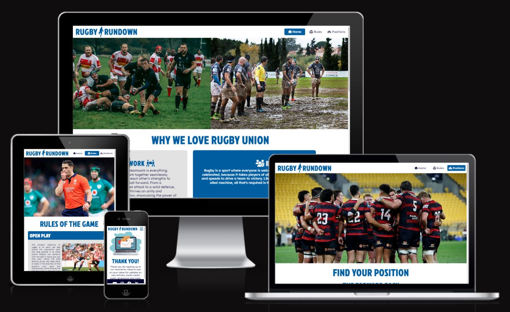

## Features

### Site Wide

#### Navigation Menu

* The navigation menu contains the **Rugby Rundown** logo, which takes users to the *Home* page when clicked, as well as individual links to the *Home*, *Positions* and *Rules* pages.
* All of these options are accessible to visually impaired users who may be using a screen reader, by the use of aria-labels.
* It uses a drop-down tab option for convenient space-saving on smaller screens (less than 768px wide), making it responsive on all devices.
* This allows users to easily navigate between pages, with the current page clearly highlighted.

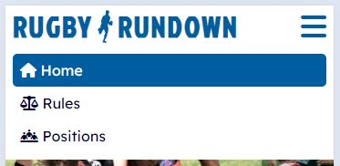

#### Footer

* The footer contains links to social media websites that will open in a new tab and a form to sign up for a newsletter.
* The newsletter form has a required text input for user's *First Name*, an optional text input for the user's *Last Name* and a required *Email* input. A reset button labelled *Clear* can be used to reset the form and a submit button labelled *Sign up* will submit the form and take the user to the *Newsletter* page which contains a thank you message.
* All interactive features within the footer are accessible to visually impaired users, by the use of aria-labels.

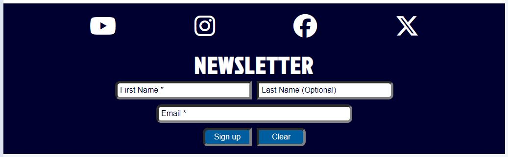

#### Favicon

* A favicon with the icon of a rugby ball is used site wide and is displayed alongside the **Rugby Rundown** name in the tab header.
* This allows users to easily identify the website if multiple tabs are open.

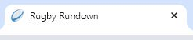

#### 404 Page

* A 404 page has been implemented and will display if the user navigates to a broken link.
* The page contains a simple message to explain the error and a button with a link back to the *Home* page.
* This allows the users to easily navigate back to the main website if they try to access a broken link or missing page.

### Landing Page

#### Gallery

* The image gallery contains a variety of images that capture different elements of the Rugby Union sport.
* A single image is visible on smaller screens (less than 1000px) and two images are visible at a time on larger screens, so the gallery is responsive on all devices. The images are in a carousel format and change on a timer.
* The purpose of the gallery is to clearly indicate the subject of the website to the user.

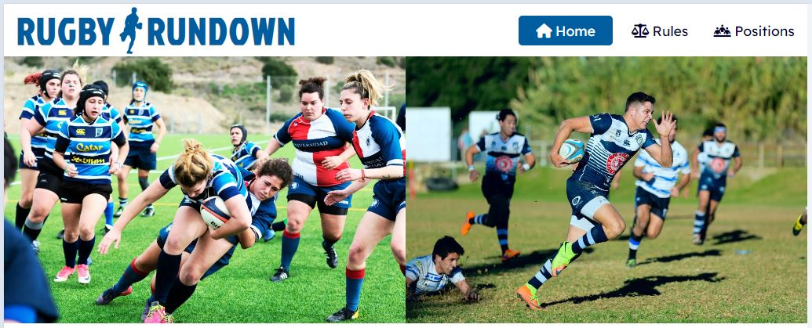

#### Reasons To Love The Sport

* This section describes the reasons we, **Rugby Rundown**, love the sport and it highlights four core values. These reasons are short and direct in order to gain the users initial interest in the website.
* The boxes stack on smaller screens (less than 1000px) and form a grid on larger screens, making it responsive on all devices.

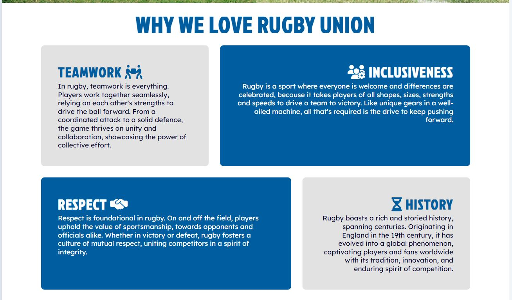

#### Club Finder

* This section has a logo for each of the British and Irish national rugby teams and links to their rugby club finder tools, which open in a new tab.
* These links are accessible for visually impaired users by the use of aria-labels.

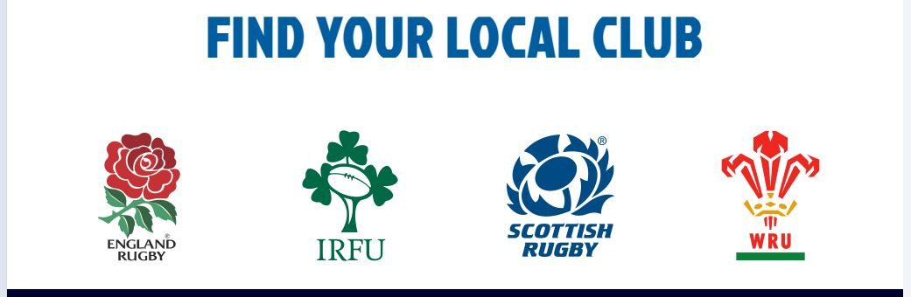

### Rules Page

#### Rules Hero Image

* The hero image for the *Rules* page features referees to highlight the importance of the laws in the sport, therefore the importance of the following content.
* An image with a more centralised focus is used for smaller screens (under 1000px) and a wider image is used for larger screens to make this section responsive and visually appealing on all devices.

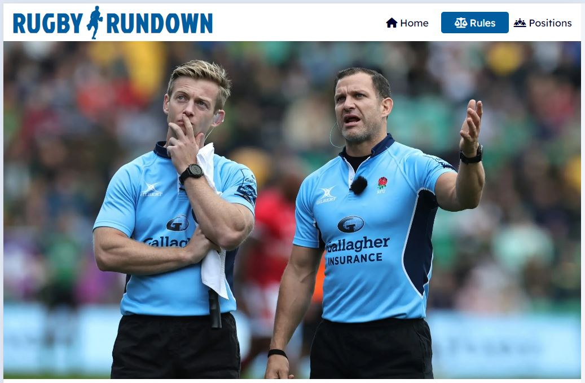

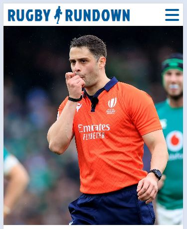

#### Rules Accordion

* An *Accordion* is used to list the major rules of the sport. The user has full control over the opening and closing of each rule through the use of *Checkbox* inputs that toggle the *Display* property of the content.
* A related image is incorporated into each rule to help the user visualise the content, these images are hidden on mobile devices (under 768px) for space-saving.

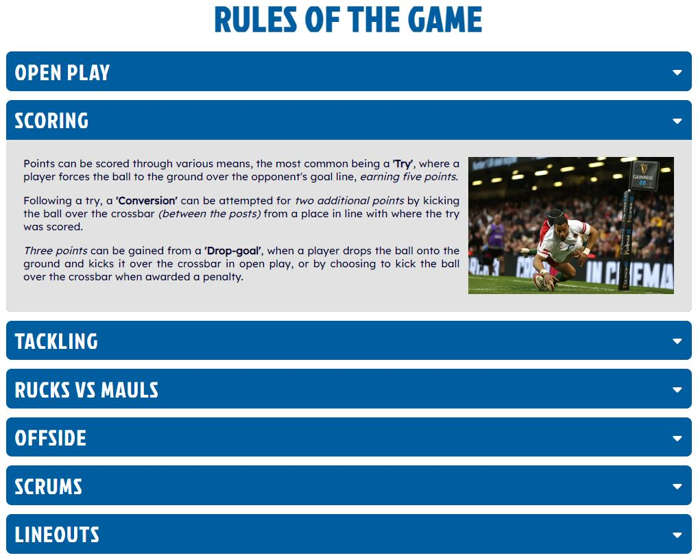

#### Rules Video

* A video is included from the *England Rugby* YouTube page that explains the basics of Rugby Union.
* The video includes controls and is responsive on all devices.

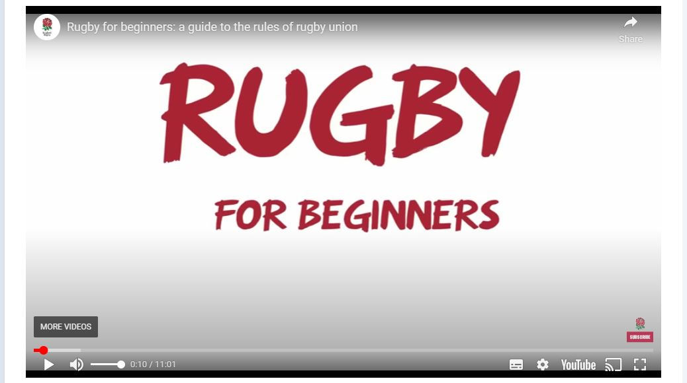

### Positions Page

#### Positions Hero Image

* The page features a hero image that shows various players and their position numbers. An image with a more centralised focus is used for smaller screens (under 1000px) and a wider image is used for larger screens to make this section responsive and visually appealing on all devices.

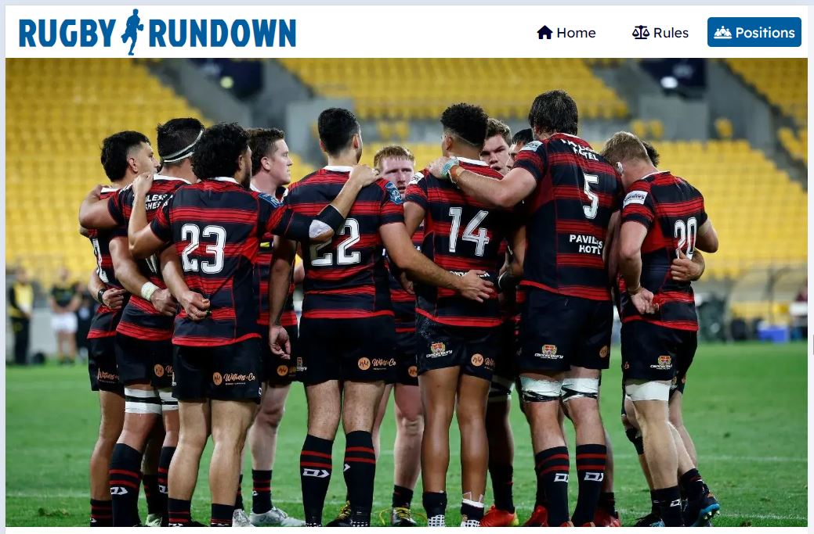

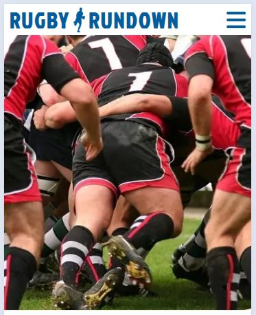

#### Forwards Accordion

* An *Accordion* is used to list the *Forwards* positions. The user has full control over the opening and closing of each position through the use of *Checkbox* inputs that toggle the *Display* property of the content.
* An image is incorporated into each content section to highlight each position's place on the pitch, these images are hidden on mobile devices (under 768px) for space-saving.

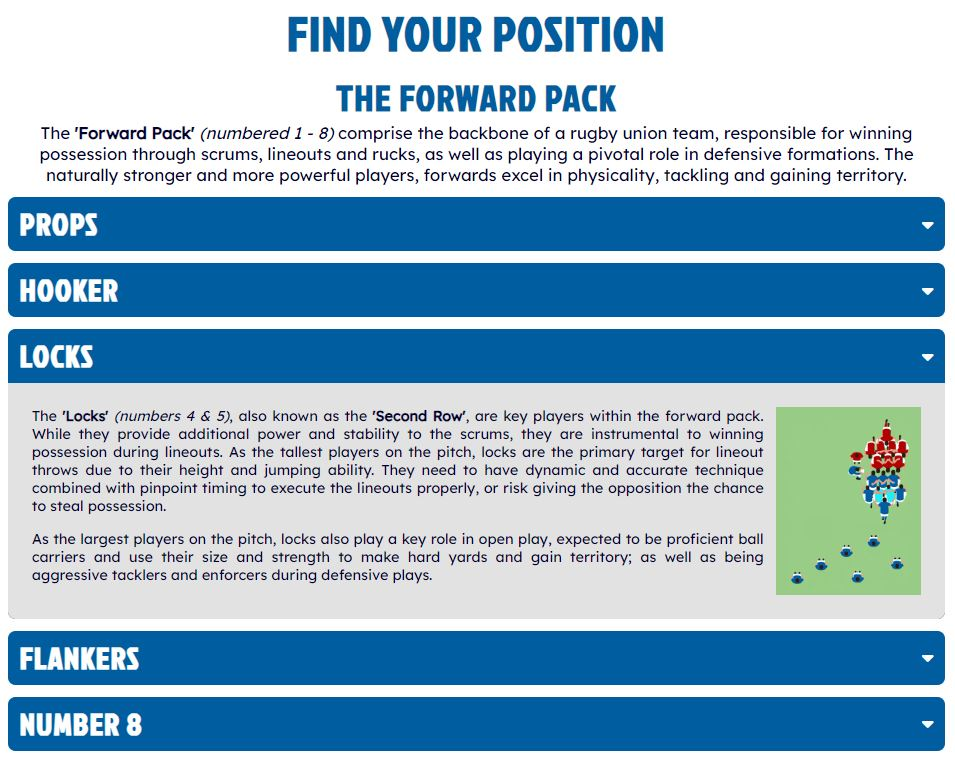

#### Backs Accordion

* The same *Accordion* code structure is used to list the *Backs* positions and the user has the same control over the opening and closing of each position.
* The images highlighting each position's place on the pitch are continued and are also hidden on mobile devices (under 768px) for space-saving.

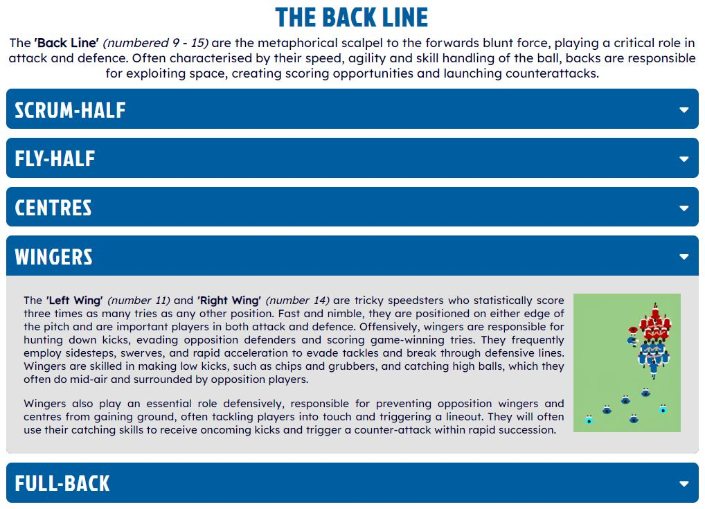

#### Positions Video

* A video is included from the *Leicester Tigers* YouTube page that explains the player's positions in Rugby Union.
* The video includes controls and is responsive on all devices.

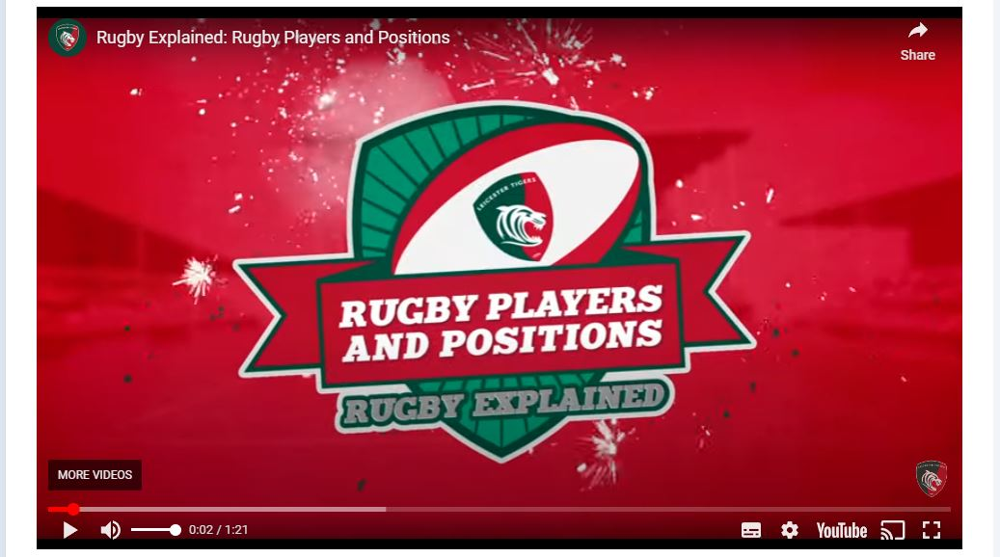

### Newsletter Page

* Once the form within the footer is completed and submitted, users will be taken to this page as confirmation of their sign up and to thank them.
* The image and text stack on smaller screens (less than 1000px), so the page is responsive on all devices.

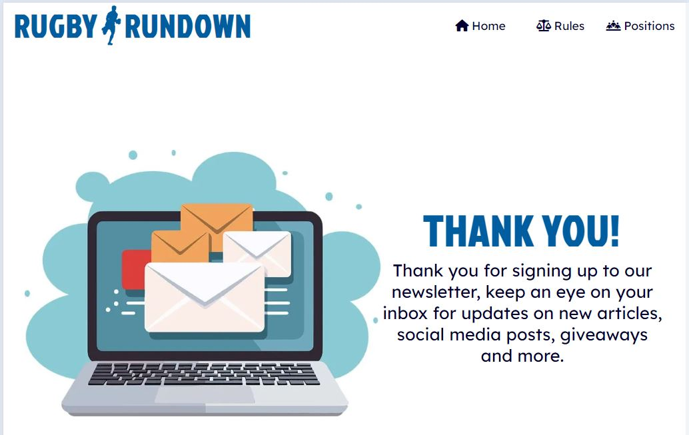

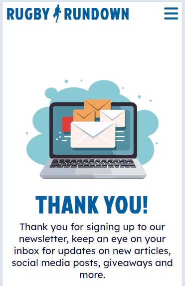

### Existing Features

* Clearly structured and easily accessible information
* Hidden interactive sections to display the information
* Newsletter form and success page
* Responsive design

### Features Left to Implement

* In the future, the accordion design used to display the information could be updated with JavaScript to have smoother and more animated opening/closing transitions.
* JavaScript could also be used within the ‘Positions’ content to allow users to interact with the player icons to open and close the relevant tab.
