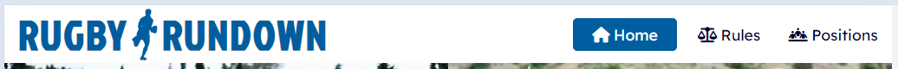
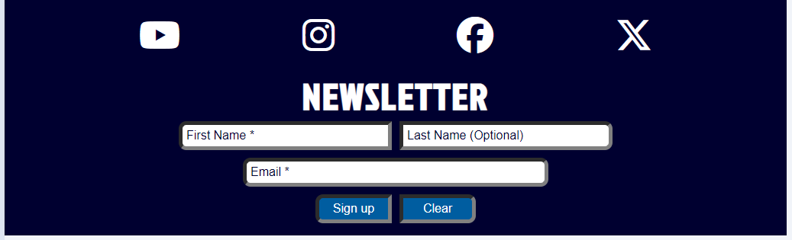
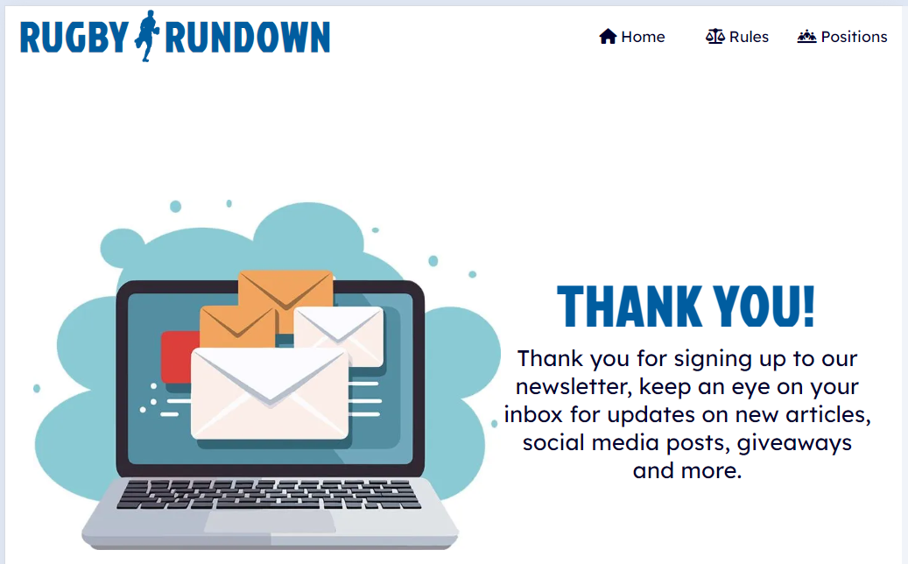
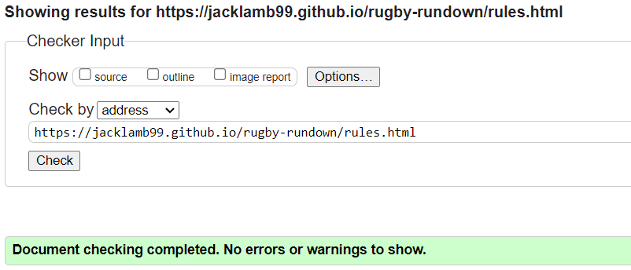

# Rugby Rundown

*Rugby Rundown* is a website that allows users to develop an understanding for the sport of Rugby Union. It explains the core values of the sport, the rules by which it is governed and the various positions that that can be played. The website also offers the options to sign up for a newsletter that will update the user on new articles, social media posts and more. View the live site [**here**](https://jacklamb99.github.io/rugby-rundown/)

## Features

### Site Wide

#### Navigation Menu

* The navigation menu contains the Rugby Rundown logo, which takes users to the *Home* page when clicked, as well as individual links to the *Home*, *Positions* and *Rules* pages.
* All of these options are accessible to visually impaired users who may be using a screen reader, by the use of aria-labels.
* It uses a drop-down tab option for convenient space-saving on smaller screens (less than 768px wide), making it responsive on all devices.
* This allows users to easily navigate between pages, with the current page clearly highlighted.

#### Footer

* The footer contains links to social media websites that will open in a new tab and a form to sign up for a newsletter.
* The newsletter form has a required text input for user's *First Name*, an optional text input for the user's *Last Name* and a required *Email* input. A reset button labelled *Clear* can be used to reset the form and a submit button labelled *Sign up* will submit the form and take the user to the *Newsletter* page which contains a thank you message.
* All interactive features within the footer are accessible to visually impaired users, by the use of aria-labels.

#### Favicon

* A favicon with the icon of a rugby ball is used site wide and is displayed alongside the *Rugby Rundown* name in the tab header.
* This allows users to easily identify the website if multiple tabs are open.

#### 404 Page

* A 404 page has been implemented and will display if the user navigates to a broken link.
* The page contains a simple message to explain the error and a button with a link back to the *Home* page.
* This allows the users to easily navigate back to the main website if they try to access a broken link or missing page.

### Landing Page

#### Gallery

* The image gallery contains a variety of images that capture different elements of the Rugby Union sport.
* A single image is visible on smaller screens (less than 1000px) and two images are visible at a time on larger screens, so the gallery is responsive on all devices. The images are in a carousel format and change on a timer.
* The purpose of the gallery is to clearly indicate the subject of the website to the user.

#### Reasons To Love The Sport

* This section describes the reasons we *(Rugby Rundown)* love the sport and it highlights four core values. These reasons are short and direct in order to gain the users initial interest in the website.
* The boxes stack on smaller screens (less than 1000px) and form a grid on larger screens, making it responsive on all devices.

#### Club Finder

* This section has a logo for each of the British and Irish national rugby teams and links to their rugby club finder tools, which open in a new tab.
* These links are accessible for visually impaired users by the use of aria-labels.

### Rules Page

#### Rules Hero Image

* The hero image for the *Rules* page features referees to highlight the importance of the laws in the sport, therefore the importance of the following content.
* An image with a more centralised focus is used for smaller screens (under 1000px) and a wider image is used for larger screens to make this section responsive and visually appealing on all devices.

#### Rules Accordion

* An accordion structure is used to list the major rules of the sport. The user has full control over the opening and closing of each rule through the use of checkbox inputs that toggle the display property of the content.
* A related image is incorporated into each rule to help the user visualise the content, these images are hidden on mobile devices (under 768px) for space-saving.

#### Rules Video

* A video is included from the *England Rugby* YouTube page that explains the basics of Rugby Union.
* The video includes controls and is responsive on all devices.

### Positions Page

#### Positions Hero Image

* The page features a hero image that shows various players and their position numbers. An image with a more centralised focus is used for smaller screens (under 1000px) and a wider image is used for larger screens to make this section responsive and visually appealing on all devices.

#### Forwards Accordion

* An accordion structure is used to list the *Forwards* positions. The user has full control over the opening and closing of each position through the use of checkbox inputs that toggle the display property of the content.
* An image is incorporated into each content section to highlight each position's place on the pitch, these images are hidden on mobile devices (under 768px) for space-saving.

#### Backs Accordion

* The same accordion structure is used to list the *Backs* positions and the user has the same control over the opening and closing of each position.
* The images highlighting each position's place on the pitch are continued and are also hidden on mobile devices (under 768px) for space-saving.

#### Positions Video

* A video is included from the *Leicester Tigers* YouTube page that explains the player's positions in Rugby Union.
* The video includes controls and is responsive on all devices.

### Newsletter Page

* Once the form within the footer is completed and submitted, users will be taken to this page as confirmation of their sign up and to thank them.
* The image and text stack on smaller screens (less than 1000px), so the page is responsive on all devices.

### Existing Features

* Clearly structured and easily accessible information
* Hidden interactive sections to display the information
* Newsletter form and success page
* Responsive design

### Features Left to Implement

* In the future, the accordion design used to display the information could be updated with JavaScript to have smoother and more animated opening/closing transitions.
* JavaScript could also be used within the *Positions* content to allow users to interact with player icons to open and close the relevant tab.

## Design

### Wireframes

#### Home Page

#### Rules Page

#### Positions Page

### Imagery

The images throughout the website have been taken from multiple sources due to the lack of relevant contextual images available from free image sources, all are credited below.

### Typography

* The *Jockey One* font from Google Fonts was used for all header elements; bold and “blocky” to create a more striking appearance.
* The *Lexend* font from Google Fonts was used for all paragraph elements; clear and simple to make the information easy to read.

### Colour Palette

## Technologies

The following technologies were used in the creation of the website:

**HTML** - The structure of the website was developed using HTML

**CSS** - The website was styled using custom CSS in an external file

[**Gitpod**](https://www.gitpod.io/) - The website was developed using the Gitpod cloud-based IDE

[**GitHub**](https://github.com/) - The source code is hosted on GitHub and deployed using Git Pages

**Git** - Used to commit and push code during the development of the website

[**Balsamiq**](https://balsamiq.com/wireframes/desktop/) - Wireframes were created using the Balsamiq desktop application

[**Google Fonts**](https://fonts.google.com/) - Used to find and import the *Jockey One* and *Lexend* fonts used throughout the website

[**Favicon.io**](https://favicon.io/) - Used to find and import the rugby ball favicon

[**Font Awesome**](https://fontawesome.com/) - Used to find and import all icons used throughout the website

[**Free Convert**](https://www.freeconvert.com/) - Used to convert the images used in the website to WEBP format

[**Tinify**](https://tinypng.com/) - Used to compress the images to reduce file sizes for improved performance

## Testing

### Responsiveness

All pages were tested using *Chrome*, *Edge*, *Opera* and *Firefox* browsers to ensure responsiveness on screen sizes from 320px and upwards as defined in [**WCAG 2.1 Reflow**](https://www.w3.org/WAI/WCAG21/Understanding/reflow.html) criteria for responsive design.

Steps to test:

1. Open selected browser and navigate to the [**Rugby Rundown Website**](https://jacklamb99.github.io/rugby-rundown/)
2. Open the developer tools to inspect
3. Set the width to responsive at 320px
4. Set the zoom to 50% to fit the larger screen sizes
5. Click and drag the width toggle at the side of the page to maximum width

Expected:

Website is responsive on all screen sizes and no horizontal scroll is present. No elements overlap and no images are stretched or oversized. 

Actual:

The website behaved as expected with the exception of the carousel gallery image size on Mozilla Firefox. Further details can be found in the [**Unfixed Bugs**](#Unfixed-Bugs) section.

The website was also opened on the following devices and no responsive issues were observed:

* Samsung Galaxy S20
* Apple iPhone 12
* Apple iPad Air
* Google Chromebook

### Accessibility

[**Wave Accessibility**](https://wave.webaim.org/) tool was used to ensure all pages met the needs for any screen readers or accessibility aids for visually impaired users. `aria-hidden="true"` labels were applied to icons and some elements used only for visual design purposes to remove unnecessary clutter for screen-readers.

Below are the results for each page, all received a positive score and no errors were found:

#### Home Page

#### Rules Page

#### Positions Page

#### Newsletter Page

#### 404 Page

### Lighthouse Testing

The *Lighthouse* extension on *Google DevTools* was used to test the overall functionality and performance of the website:

#### Home Page

#### Rules Page

#### Positions Page

#### Newsletter Page

#### 404 Page

### Functional Testing

#### Navigation Links

Testing was performed to ensure all navigation links directed the user to the correct pages as designed:

| Navigation Link | Directed to Page |
| :---- | :---- |
| Rugby Rundown Logo | [index.html](https://jacklamb99.github.io/rugby-rundown/index.html) |
| Home | [index.html](https://jacklamb99.github.io/rugby-rundown/index.html) |
| Rules | [rules.html](https://jacklamb99.github.io/rugby-rundown/rules.html) |
| Positions | [positions.html](https://jacklamb99.github.io/rugby-rundown/positions.html) |

#### Newsletter Form

The form within the footer to sign up for the newsletter was tested to ensure it functioned as expected when correct and incorrect data was input.

##### Test One – Correct Inputs

| Input | Requirement | Data |
| :---- | :---- | :---- |
| First Name | Required | John |
| Last Name | Optional | Smith |
| Email | Required | johnsmith@testing.com |

Expected:

The form submits with no errors and user is redirected to the *newsletter.html* page.

Actual:

The website performed as expected, no errors occurred and the user was redirected to the *newsletter.html* page.

##### Test Two – Missing First Name Field

| Input | Requirement | Data |
| :---- | :---- | :---- |
| First Name | Required |  |
| Last Name | Optional | Smith |
| Email | Required | johnsmith@testing.com |

Expected:

The form does not submit and an error message is displayed to tell the user that the *First Name* field is required.

Actual:

The website performed as expected, an error message was displayed and the form did not submit.

##### Test Three – Missing Last Name Field

| Input | Requirement | Data |
| :---- | :---- | :---- |
| First Name | Required | John |
| Last Name | Optional |  |
| Email | Required | johnsmith@testing.com |

Expected:

The form submits with no errors and user is redirected to the *newsletter.html* page.

Actual:

The website performed as expected, no errors occurred and the user was redirected to the *newsletter.html* page.

##### Test Four – Missing Email Field

| Input | Requirement | Data |
| :---- | :---- | :---- |
| First Name | Required | John |
| Last Name | Optional | Smith |
| Email | Required |  |

Expected:

The form does not submit and an error message is displayed to tell the user that the *Email* field is required.

Actual:

The website performed as expected, an error message was displayed and the form did not submit.

##### Test Five – Incorrect Email Format

| Input | Requirement | Data |
| :---- | :---- | :---- |
| First Name | Required | John |
| Last Name | Optional | Smith |
| Email | Required | johnsmithtesting.com |

Expected:

The form does not submit and an error message is displayed to tell the user to use a valid email format that includes an @ symbol.

Actual:

The website performed as expected, an error message was displayed and the form did not submit.

#### Footer Social Media Links

Testing was performed on the four *Social Media* icons within the footer to ensure that each link opened in a new tab and directed the user to the correct website.

Each link acted as expected, opening the correct site in a new tab.

#### Rugby Club Finder Links

Testing was performed on the four *National Rugby* logos at the bottom of the *Home* page to ensure that each link opened in a new tab and directed the user to the correct page within the website.

Each link acted as expected, opening the correct page on the website in a new tab.

#### Accordions

Testing was performed on the three accordion structures used on the *Rules* and *Positions* pages to ensure each individual tab could be opened and closed on command by clicked anywhere on the tab’s header container.

All of the accordions acted as expected, allowing the user to have full control over of each tab and the display of its content.

#### Embedded Videos

The embedded *YouTube* videos at the bottom of the *Rules* and *Positions* pages were tested to ensure the user has full control over the pause/play, audio and other settings.

Both videos acted as expected, allowing the user to have full control over all playback controls and settings.

#### 404 Home Button

The *Home* button on the *404.html* page was tested to ensure it redirected the user to the *index.html* page and that it had the styled hover effect with alternate colours. The button performed as expected.

### Validator Testing

#### HTML

No errors occurred when passing each page through the official [**W3C Markup Validation Service**](https://validator.w3.org/)

#### Home Page

#### Rules Page

#### Positions Page

#### Newsletter Page

#### 404 Page

#### CSS

No errors occurred when passing through the official [**W3C CSS Validation Service**](https://jigsaw.w3.org/css-validator/)

### Unfixed Bugs

The website functions as expected on all browsers with the exception of the *Gallery* carousel on the *Mozilla Firefox* browser. I was unable to resolve this bug on time but will address in a future release.